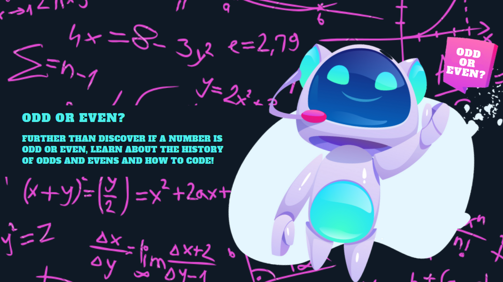

# Challenge: Even or Odd?


<b>Made with:</b><br/>
<p align="center">


</p>
<br/><br/>
<b>What is this?</b><br/>
A little challenge to show if it's even or odd using JS :)
<br/><br/>
<b>Description:</b><br/>
A little challenge to show if it's even or odd using JS :)
<br/><br/>
# Quick links &#128150;
  
[PROJECT SETUP](#Project-setup) &diams; [PREVIEW](#Preview) &diams; [STATUS OF THE PROJECT](#How-is-the-development-of-the-project-right-now) &diams; [CREDITS](#Credits) &diams; [BACK TO TOP](#Challenge-Even-Or-Odd)


# Project setup
```
Open on yout favorite browser ;)
```

<b>Thank you for your support!</b>

# Preview


# How is the development of the project right now?
<b>Last update:</b> 05/03/2021

Readme updated :)

<br/>

# Credits

Lorem ipsum dolor sit amet

<i>Stay awesome Gothan!</i>
  
[PROJECT SETUP](#Project-setup) &diams; [PREVIEW](#Preview) &diams; [STATUS OF THE PROJECT](#How-is-the-development-of-the-project-right-now) &diams; [CREDITS](#Credits) &diams; [BACK TO TOP](#Challenge-Even-Or-Odd)
